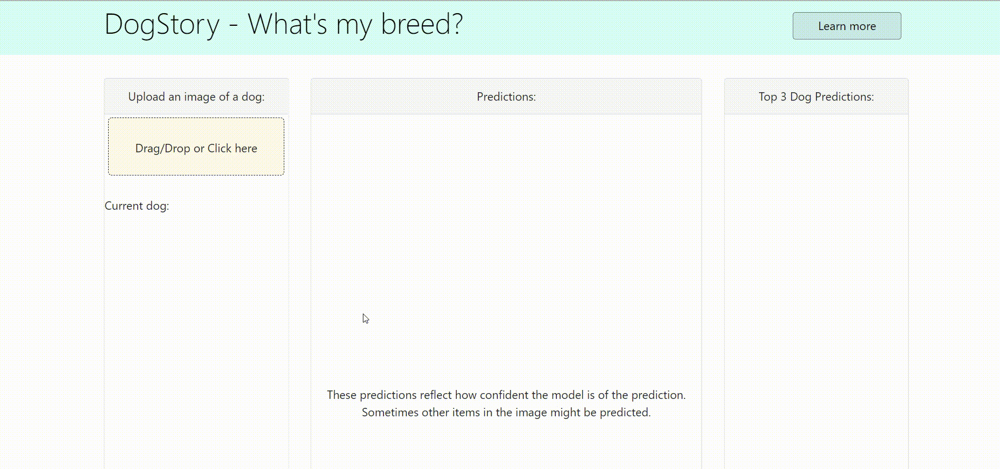

# Dog-Classifier-App

https://dogstory.herokuapp.com/

This web app allows users to upload a picture of a dog. The app predicts the dog's breed using the the Pytorch "densenet121" CNN model. The model hasn't been modified in any way. I have tentative plans to add more breeds than the 119 breeds currently available, but that's for a later version.

The purpose of this app is to pactice deploying a Dash app on Heroku.

